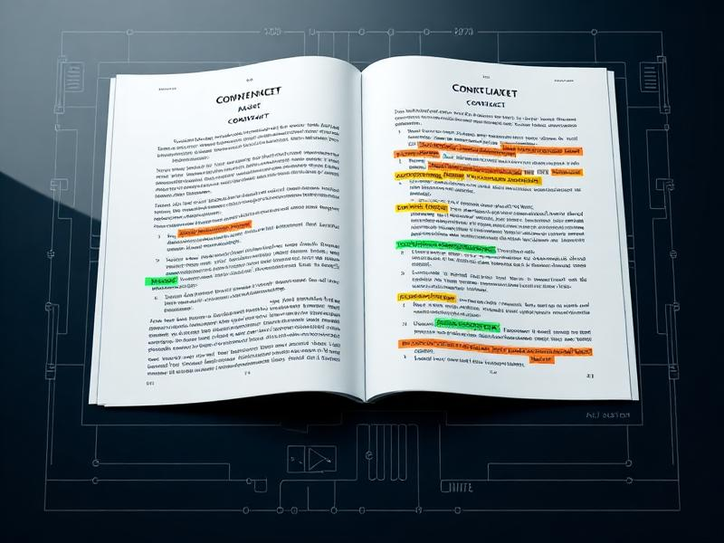
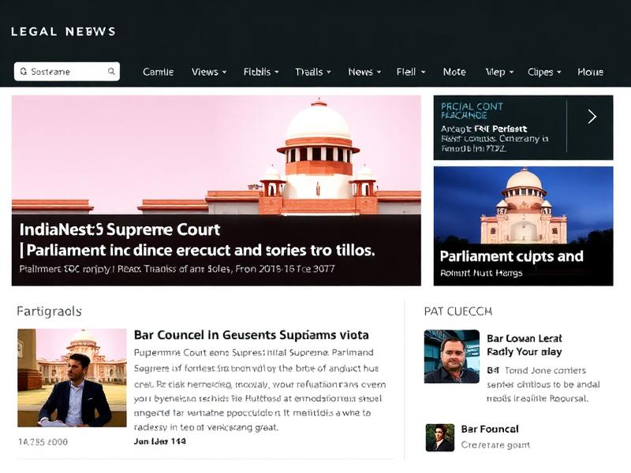

git remote set-url origin https://github.com/rohan911438/LAW_MADE_EASY-AI.git
git remote -v# Law Made Easy AI

Making law simple, accessible, and transparent with AI.

- Live Demo: https://lovable.dev/projects/10e7faec-c75a-4a7b-a30d-9106e781095e
- GitHub: https://github.com/rohan911438


## Overview

Law Made Easy AI is a Vite + React + TypeScript web app that helps users:
- Simplify complex legal documents into plain English
- Check document authenticity with AI-assisted analysis and risk scoring
- Stay updated with curated Indian legal news
- Explore a social-style feed of legal professionals and posts (local-first demo)

The app works in a “demo-first” mode with graceful fallbacks, and optionally connects to Supabase for authentication, history, and analytics.


## Features

- Legal Simplifier: Paste text or upload PDF/DOC/DOCX; get simplified, accurate summaries with key terms highlighted.
- Document Authenticity: AI-powered analysis detecting fraud indicators, missing clauses, and compliance issues, with risk levels.
- Legal News Feed: Category filters, tags, importance badges, and details modal; uses NewsAPI when a key is set, else mock data.
- Legal Social Feed (Demo): Local-first profiles and posts with filters by specialization and tags.
- Auth + History (Optional): Sign in with Supabase to save processed documents and revisit results.
- Robust Parsing: PDF/DOC/DOCX parsing via `pdf-parse`, `pdfjs-dist`, `mammoth`, and drag-drop via `react-dropzone`.


## Tech Stack

- App: Vite, React 18, TypeScript, React Router, TanStack Query
- UI: Tailwind CSS, shadcn/ui, Radix Primitives, lucide-react
- Data/Backend: Supabase (Auth, DB), Axios
- AI: Google Generative Language API (Gemini 1.5 Flash) for simplification and authenticity analysis
- Utils: date-fns, react-hook-form, zod, react-dropzone, recharts


## Project Structure

```
src/
  pages/                 # Views: Index, LegalSimplifier, DocumentAuthenticity, LegalNewsFeed, LegalSocialFeed
  components/            # UI and feature components (modals, filters, cards)
  components/ui/         # shadcn/ui primitives
  services/              # API services: legalSimplifierAPI, documentAuthenticityAPI, legalNewsAPI, legalSocialAPI, database
  hooks/                 # Custom hooks
  assets/                # Images used by pages
  lib/                   # Utilities
```

Database schema for Supabase is provided in `database-schema.sql`.


## Screenshots

> Add or replace with your own screenshots.






## Getting Started

Prerequisites:
- Node.js 18+ and npm 9+

Install and run locally:

```
git clone https://github.com/rohan911438/law-made-easy-ai.git
cd law-made-easy-ai
npm install
npm run dev
```

Build and preview production build:

```
npm run build
npm run preview
```


## Environment Variables

The app can run without any keys (uses mock data where needed). To enable live APIs and your own backend, configure the following in a `.env` file at repo root:

```
# News API (optional for live news)
VITE_NEWS_API_KEY=your_newsapi_key

# Recommended: move these to env and update services to read from env
# VITE_GOOGLE_API_KEY=your_google_generative_language_api_key
# VITE_SUPABASE_URL=your_supabase_url
# VITE_SUPABASE_ANON_KEY=your_supabase_anon_key
```

Notes:
- `src/services/legalNewsAPI.ts` already reads `VITE_NEWS_API_KEY`.
- `src/services/legalSimplifierAPI.ts`, `src/services/documentAuthenticityAPI.ts`, and `src/services/database.ts` currently use inline demo keys/constants. For production, switch them to read from `import.meta.env` and never commit secrets.


## Database (Supabase)

The SQL for tables used by the app is in `database-schema.sql`. To set up:
1. Create a new Supabase project.
2. Open SQL editor and run the contents of `database-schema.sql`.
3. In production, update `src/services/database.ts` to read `VITE_SUPABASE_URL` and `VITE_SUPABASE_ANON_KEY` from env.
4. Optional: Configure Row Level Security (RLS) policies per your needs.

Tracked entities include:
- `users`, `document_processing`, `usage_tracking`, `billing_records`, `document_authenticity`


## Development Notes

- Routes: see `src/App.tsx` for path mapping.
- Simplifier flow: `src/pages/LegalSimplifier.tsx` orchestrates parsing, progress UI, and calls `legalSimplifierAPI`.
- Authenticity flow: `src/pages/DocumentAuthenticity.tsx` + `documentAuthenticityAPI` with staged progress and a structured AI JSON output.
- News feed: `legalNewsAPI` fetches from NewsAPI when `VITE_NEWS_API_KEY` is present; otherwise uses curated mock items with filters and tags.
- Social feed: `legalSocialAPI` seeds localStorage with demo professionals and posts.


## Deployment

- Live Demo: https://lovable.dev/projects/10e7faec-c75a-4a7b-a30d-9106e781095e

Static hosting (Vercel/Netlify/Static Site):
1. Build with `npm run build`.
2. Deploy the `dist/` folder.
3. Ensure environment variables are configured in your hosting provider if you enable live APIs.


## Security & Compliance

- Do not commit API keys or secrets. Prefer `VITE_*` env vars and server-side proxies for sensitive operations.
- This application is for educational and accessibility purposes and does not provide legal advice. Always consult a qualified legal professional.


## Roadmap

- Move all keys to environment variables; add `.env.example`.
- Server-side proxy for AI requests with rate-limiting.
- Export reports (PDF) and shareable links.
- More granular RLS policies and audit logs in Supabase.


## Contributing

Issues and PRs are welcome. If you plan a larger change, please open an issue first to discuss the approach.


## Author

- GitHub: @rohan911438


## License

No license specified. If you intend to open source, add a LICENSE file (e.g., MIT) and update this section.
